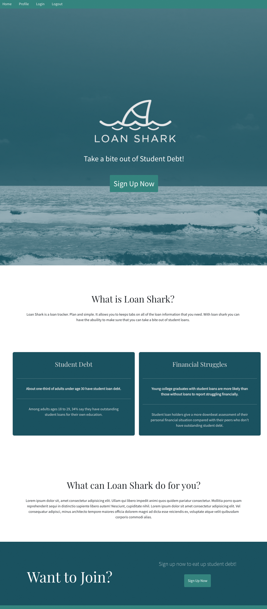
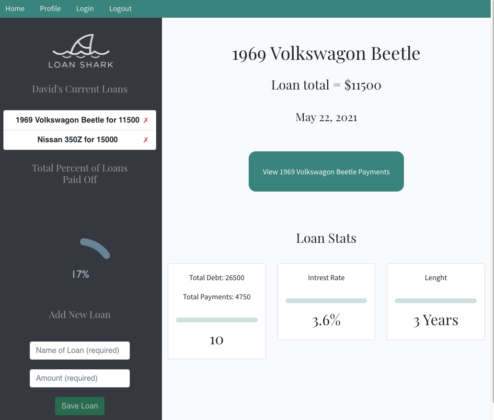
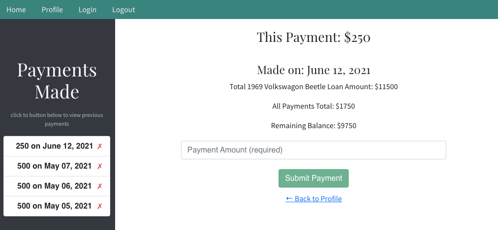

<h1 align="center">🦈 Loan Shark 🦈 </h1>
<h4 align="center">Caitlin Murphy, Richard Seward, David Bushard </h4> 
<h5 align="center">University of Denver - Final Project</h5>
 

## Table of Contents

- [Description](#description)
- [Installation](#installation)
- [Usage](#usage)
- [License](#license)
- [Contact Info](#Contact-Info:)
   
   

## Description

Manage your student loans <a href="https://loaning-sharks.herokuapp.com/" target="_blank" rel="noopener noreferrer">here</a>...

This project was bootstrapped with [Create React App](https://github.com/facebook/create-react-app), and styled using [ReactStrap](https://reactstrap.github.io/).
 
 

## User Story

Do you have student debt? auto loans? random debt you want to track? we feel that we have developed a tool that will allow you to track all of that. With Loan Shark, you now have the ability to track all of your loans. Keep track of all your payments, when the payment was made and see your progress. With Loan Shark, take a bite out of student debt.

 
 

## Installation

### `npm install -y`

 
 

## Usage

### `npm start`

Runs the app in the development mode.\
Open [http://localhost:3000](http://localhost:3000) to view it in the browser.

The page will reload if you make edits.\
You will also see any lint errors in the console.
 
 

## Links and Images

Repo - https://github.com/raseward14/loan_shark
 
Heroku App - https://loaning-sharks.herokuapp.com/
 
 

 

 

RESOURCES

- guru99 Mongodb Primary Key https://www.guru99.com/mongodb-objectid.html
- ObjectRocket How to Join Collections using Mongoose https://kb.objectrocket.com/mongo-db/how-to-join-collections-using-mongoose-228
- Mongoose.js deprecation error docs https://mongoosejs.com/docs/deprecations.html
- MongoDB Document Structure https://docs.mongodb.com/manual/core/document/#the-id-field
  tutorialspoint MongoDB https://www.tutorialspoint.com/mongodb/mongodb_objectid.htm
  flaviocopes Connect React to Server https://flaviocopes.com/how-to-serve-react-from-same-origin/
- CSS Tricks https://css-tricks.com/everything-you-need-to-know-about-date-in-javascript/
- JS String Tutorial https://www.javascripttutorial.net/javascript-string-split/#:~:text=JavaScript%20String%20split%20%28%29%201%20Introduction%20to%20the,JavaScript%20split%20%28%29%20examples.%20...%205%20Summary.%20
- Owen Conti Unmounted Component Tutorial https://www.youtube.com/watch?v=a7uPQ10UyM0
   

 
 

 

 

## Contact Info

Caitlin Murphy

Find me on GitHub:

 
Email me with any questions: Caimmurphy@gmail.com
 
 ___________________________________________________________
 
 
Richard Seward

Find me on GitHub:

 
Email me with any questions: Raseward14@gmail.com
 
 ___________________________________________________________
 
 
David Bushard

Find me on GitHub:

 
Email me with any questions: Davidbushard@gmail.com
 
